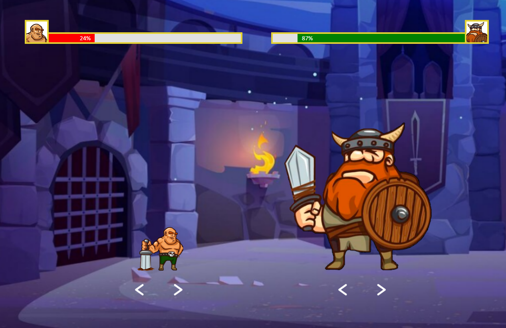
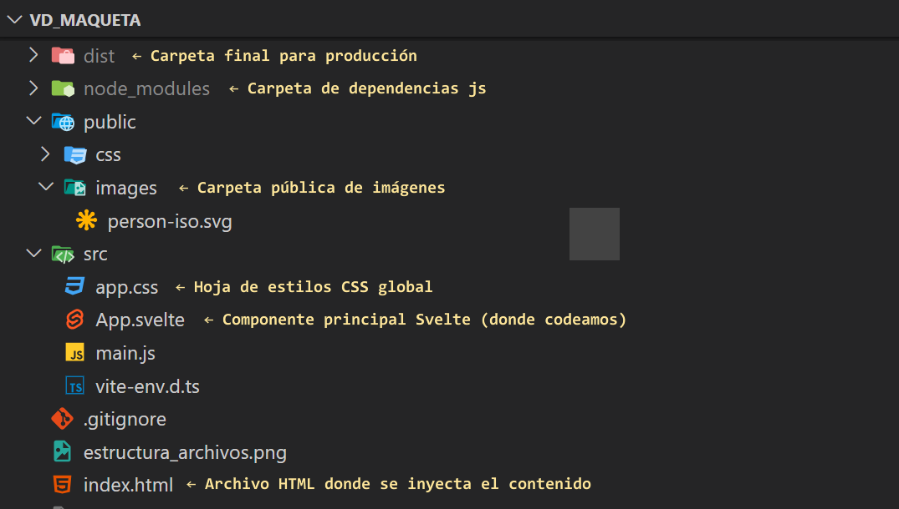

# VD | Maqueta inicial web (HTML, CSS, Svelte)

<!-- image .md -->


---

## Descripción:
En el reino de Valdranor, la Arena de los Campeones era el lugar donde solo los guerreros más valientes podían demostrar su honor. Durante siglos, grandes batallas se habían librado allí, pero ninguna como la que estaba por suceder.

Un llamado ancestral ha reunido a cada uno de los guerreros, quienes han crecido en fuerza con sus enfrentamientos y victorias pasados. El tamaño de cada figura simboliza su poder, sus habilidades, su valor y su reputación.

No solo son combatientes. Son vikingos que cuentan historias. Brak el Gladiador, quien ha estado en constante ascenso, tendrá que enfrentarse ahora con guerreros como Hargoth el Imbatible, cuyo poder ya había alcanzado a la cima convirtiéndose en una leyenda viviente. De a poco, Brak pierde cada vez más fuerza, mientras que Hargoth sigue casi intacto. ¿Será el fin del pequeño guerrero?

## Estructura de archivos:



## Requerimientos:

- [Node.js](https://nodejs.org/es/) version 18+ ó 20+

## Dependencias:
Ejecutar el siguiente comando para instalar las dependencias del proyecto:
```bash	
npm install
```

## Desarrollo:
Ejecutar el siguiente comando para iniciar el servidor de desarrollo que generará un servidor local y recargará el navegador automáticamente. Hacer click sobre la url que se muestra en la consola para abrir el navegador.

```bash	
npm run dev
```

## Build :
Ejecutar el siguiente comando para generar los archivos de producción (html, css, js y assets) en la carpeta `dist`:
```bash	
npm run dev
```
