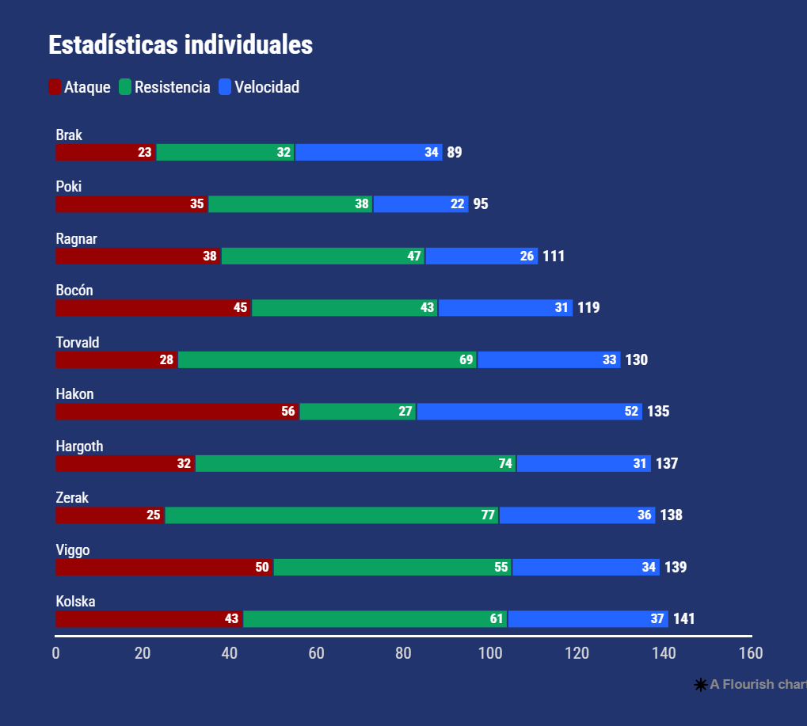

# VD | DashBoard Web

<!-- image .md -->


---

## Descripción:
En el reino de Valdranor, la Arena de los Campeones era el lugar donde solo los guerreros más valientes podían demostrar su honor. Durante siglos, grandes batallas se habían librado allí, pero ninguna como la que estaba por suceder.

Un llamado ancestral ha reunido a los mejores 10 combatientes, quienes han crecido en fuerza con sus enfrentamientos y victorias pasados. Luego de una larga espera, la batalla ha dado su inicio.

No solo son combatientes. Son vikingos que cuentan historias. Brak el Gladiador, quien ha estado en constante ascenso, tendrá que enfrentarse ahora con leyendas como Hargoth el Imbatible, un guerrero temido incluso entre los más valientes. ¿Quién se alzará como el verdadero campeón de la Arena?

---

## Catálogo:


## Gráficos:




## Requerimientos:

- [Node.js](https://nodejs.org/es/) version 18+ ó 20+

## Dependencias:
Ejecutar el siguiente comando para instalar las dependencias del proyecto:
```bash	
npm install
```

## Desarrollo:
Ejecutar el siguiente comando para iniciar el servidor de desarrollo que generará un servidor local y recargará el navegador automáticamente. Hacer click sobre la url que se muestra en la consola para abrir el navegador.

```bash	
npm run dev
```

## Build :
Ejecutar el siguiente comando para generar los archivos de producción (html, css, js y assets) en la carpeta `dist`:
```bash	
npm run dev
```
